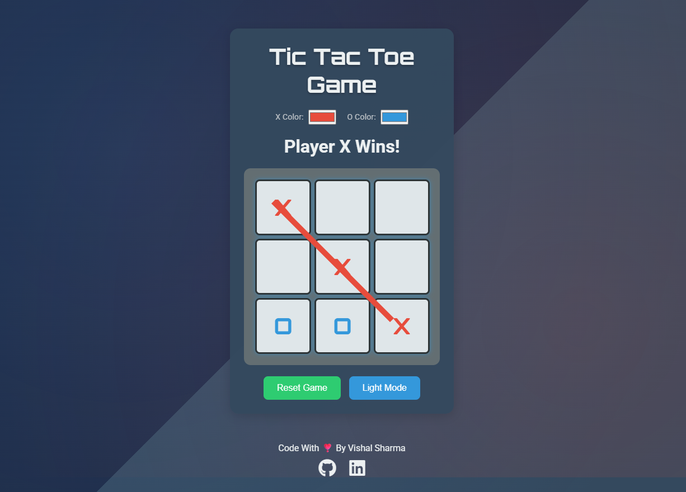

# Modern-Tic-Tac-Toe-WebGame ❌⭕🎮

A modern, responsive Tic Tac Toe web game built with HTML, CSS, and JavaScript — featuring theme toggle, custom colors, animations, and sound effects.



## 🔗 Live Demo

🎮 Try it out here on live running website: [Modern-Tic-Tac-Toe-WebGame](https://tbhvishal.github.io/Modern-Tic-Tac-Toe-WebGame/)

## Features

- **Interactive Gameplay**: Clickable grid with real-time win detection and draw handling.
- **Customizable Colors**: Choose different colors for "X" and "O" using the in-app color pickers.
- **Theme Toggle**: Switch between light and dark modes seamlessly.
- **Audio Effects**: Built-in sounds for click, win, draw, and reset.
- **Animated Win Line**: Draws a line over the winning combination.
- **Victory Particles**: Fun particle burst when someone wins.
- **Responsive Design**: Smooth experience on desktops, tablets, and phones.
- **No Frameworks**: Pure HTML, CSS, and JavaScript — lightweight and fast.

## Installation

### Step 1: Clone the repository

```bash
git clone https://github.com/tbhvishal/Modern-Tic-Tac-Toe-WebGame.git
```

### Step 2: Navigate to the project folder

```bash
cd Modern-Tic-Tac-Toe-WebGame
```

### Step 3: Open the game

You can open `index.html` directly in any modern web browser (Chrome, Firefox, Edge, etc.):  

```bash
start index.html     # Windows
open index.html      # macOS
xdg-open index.html  # Linux
```

### Step 4: Enjoy!

Start playing instantly with zero setup.

## Configuration

You can customize the following features directly within the UI:

- **Player Colors**: Use the color picker to change the "X" and "O" colors in real time.
- **Themes**: Toggle between Light and Dark mode.
- **Reset Game**: Start over anytime with the Reset button.

### Sound Effects Included

Located in the `assets/audio/` folder:

- `click.mp3` – Played on each move  
- `win.mp3` – Celebrates a win  
- `draw.mp3` – Plays on a draw  
- `start.mp3` – Plays when game resets

## How to Use

- Click on a cell to make a move.
- Watch the game announce turns, wins, and draws.
- Change player colors using the color pickers.
- Click “Reset Game” to play again.
- Toggle Light/Dark mode for a personalized experience.

## Additional Functionalities

- **Win Animation**: A line draws across the winning pattern.
- **Victory Particles**: Celebratory animation on player win.
- **Responsive UI**: Scales down beautifully on mobile.
- **Optimized CSS Animations**: Clean and smooth transitions.

## Support

If you find this project helpful and fun to play:

- 🌟 Star the repo on GitHub
- 🍴 Fork it to your own profile
- 🛠️ Submit ideas or bugs under Issues
- 🙌 Share with friends!

## Contributing

Contributions are welcome to improve the game further!

1. Fork the repository  
2. Create a new branch (`git checkout -b feature-branch`)  
3. Commit your changes (`git commit -am 'Add cool feature'`)  
4. Push to the branch (`git push origin feature-branch`)  
5. Create a Pull Request

## Issues

Found a bug? Have a suggestion?  
[Create a GitHub Issue](https://github.com/tbhvishal/Modern-Tic-Tac-Toe-WebGame/issues) — I’d love to hear from you!

## License

This project is licensed under the **MIT License** — free for personal or commercial use.

## Acknowledgments

- Thanks to all open-source contributors.
- Sounds and animations powered by simple logic and creativity — no external libraries used.

## Contact

For collaboration or questions:

- GitHub: [@tbhvishal](https://github.com/tbhvishal)
- Email: [vishal95844@gmail.com](mailto:vishal95844@gmail.com)

Let’s make simple games more fun and beautiful! 🕹️💡
